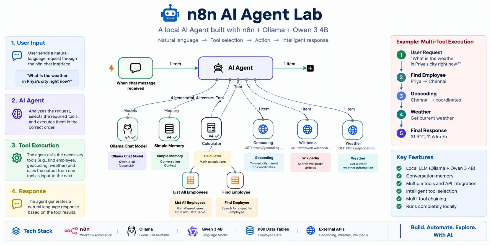

# 🤖 n8n AI Agent Lab

A local AI Agent built with **n8n + Ollama + Qwen 3 4B**, demonstrating AI-powered workflow automation, tool calling, conversation memory, structured data access, external APIs, and multi-tool execution.

The goal of this project is to explore how an AI Agent can understand natural-language requests and dynamically decide which tools it needs to answer them.

---

## 🚀 Project Overview

This project runs an AI Agent locally using:

- **n8n** — workflow automation and AI Agent orchestration
- **Ollama** — local LLM runtime
- **Qwen 3 4B** — local language model
- **n8n Simple Memory** — conversation context
- **n8n Data Tables** — structured employee data
- **HTTP Request tools** — external API integration

The user interacts with the system through an n8n chat interface.

Instead of creating a separate workflow for every question, the AI Agent determines which tool is required and executes it.

### Example

A user can ask:

```text
What is the weather in Arjun's city?
```

The agent can determine that it needs to:

```text
Find Arjun
      ↓
Get Arjun's location
      ↓
Geocode the location
      ↓
Get current weather
      ↓
Generate the final response
```

This demonstrates **AI Agent tool chaining**.

---

# 🏗️ Architecture


```text
                         ┌──────────────────────┐
                         │        USER          │
                         │                      │
                         │ Natural Language     │
                         │      Request         │
                         └──────────┬───────────┘
                                    │
                                    ▼
                         ┌──────────────────────┐
                         │     n8n Chat         │
                         │       Trigger       │
                         └──────────┬───────────┘
                                    │
                                    ▼
                         ┌──────────────────────┐
                         │      AI Agent        │
                         │                      │
                         │  Request Analysis    │
                         │  Tool Selection      │
                         │  Tool Execution      │
                         │  Response Generation │
                         └──────────┬───────────┘
                                    │
                  ┌─────────────────┼──────────────────┐
                  │                 │                  │
                  ▼                 ▼                  ▼
          ┌──────────────┐  ┌──────────────┐  ┌──────────────┐
          │ Ollama       │  │   Memory     │  │    Tools     │
          │              │  │              │  │              │
          │ Qwen 3 4B    │  │ Session      │  │ Calculator   │
          │ Local LLM    │  │ Context      │  │ Employees    │
          └──────────────┘  └──────────────┘  │ Geocoding    │
                                              │ Weather      │
                                              │ Wikipedia    │
                                              └──────┬───────┘
                                                     │
                                  ┌──────────────────┼──────────────────┐
                                  │                  │                  │
                                  ▼                  ▼                  ▼
                           ┌─────────────┐   ┌──────────────┐   ┌────────────┐
                           │ n8n Data    │   │ Open-Meteo   │   │ Wikipedia  │
                           │ Table       │   │ APIs         │   │ API        │
                           │             │   │              │   │            │
                           │ employees   │   │ Geocoding    │   │ Search     │
                           │             │   │ Weather      │   │            │
                           └─────────────┘   └──────────────┘   └────────────┘
```

For a more detailed architecture explanation, see:

📄 [`docs/architecture.md`](docs/architecture.md)

---

# 🧠 AI Agent Capabilities

The agent currently supports several types of tasks.

## 1. 💬 Conversation Memory

The agent can remember information within the current chat session.

Example:

```text
User:
My name is Ajay.
```

Then:

```text
User:
What is my name?
```

The agent can use its conversation memory to answer:

```text
Your name is Ajay.
```

---

## 2. 🧮 Calculator

The agent can use a calculator tool for mathematical operations.

Example:

```text
Calculate 347 * 829.
```

Result:

```text
287663
```

Another example:

```text
Calculate 125 * 48.
```

Result:

```text
6000
```

---

## 3. 👨‍💻 Employee Search

The agent can search employee information stored in an n8n Data Table.

Example:

```text
Where does Ajay work?
```

The tool retrieves:

```text
Name: Ajay
Role: Data Engineer
Location: Hyderabad
```

The agent does not need employee information to be hard-coded into the prompt.

---

## 4. 👥 List Employees

The agent can retrieve all employee records.

Example:

```text
Who are all the employees?
```

Example data:

| Name | Role | Location |
|---|---|---|
| Ajay | Data Engineer | Hyderabad |
| Rahul | Developer | Bangalore |
| Priya | Data Analyst | Chennai |
| Arjun | Software Engineer | Mumbai |

---

## 5. 🌍 Geocoding

The agent can convert a city or location into geographic coordinates using the Open-Meteo Geocoding API.

Example:

```text
Mumbai
```

The API provides:

```text
Latitude
Longitude
```

---

## 6. 🌤️ Weather

The agent can retrieve current weather information using geographic coordinates.

Example:

```text
What is the weather in Mumbai?
```

The workflow is:

```text
Mumbai
   ↓
Geocoding
   ↓
Latitude + Longitude
   ↓
Weather API
   ↓
Current Weather
```

---

## 7. 📚 Wikipedia

The agent can search Wikipedia for general factual information.

Example:

```text
Who is Alan Turing?
```

The agent can use the Wikipedia tool to retrieve relevant search results.

---

# 🔗 Multi-Tool Execution

One of the main goals of this project is demonstrating that an AI Agent can coordinate multiple tools.

Consider:

```text
What is the weather in Arjun's city?
```

The agent needs information from multiple sources.

### Step 1

Search the employee table:

```text
Find Employee
       ↓
Arjun
       ↓
Mumbai
```

### Step 2

Convert Mumbai into coordinates:

```text
Mumbai
   ↓
Geocoding API
   ↓
Latitude + Longitude
```

### Step 3

Retrieve weather:

```text
Latitude + Longitude
       ↓
Weather API
       ↓
Current Weather
```

### Step 4

Generate the response:

```text
Tool Results
     ↓
AI Agent
     ↓
User-Friendly Response
```

This is an example of **tool chaining**.

---

# 🛠️ Tools

| Tool | Purpose |
|---|---|
| Calculator | Mathematical calculations |
| Find Employee | Search an employee by name |
| List All Employees | Retrieve all employees |
| Geocoding | Convert locations to coordinates |
| Weather | Retrieve current weather |
| Wikipedia | Search general factual information |
| Simple Memory | Maintain conversation context |

---

# 🧰 Technology Stack

| Technology | Purpose |
|---|---|
| **n8n** | Workflow automation and AI Agent |
| **Ollama** | Local LLM runtime |
| **Qwen 3 4B** | Local language model |
| **n8n Data Tables** | Employee data storage |
| **Open-Meteo** | Geocoding and weather APIs |
| **Wikipedia API** | Knowledge search |
| **Node.js** | n8n runtime |
| **PowerShell** | Local environment management |
| **Git / GitHub** | Version control and project showcase |

---

# 📁 Project Structure

```text
n8n-ai-agent-lab/
│
├── README.md
├── .gitignore
│
├── data/
│   └── employees.json
│
├── docs/
│   ├── architecture.md
│   └── setup.md
│
└── workflows/
    └── local-ai-agent.json
```

### `README.md`

Main project documentation and overview.

### `workflows/`

Contains exported n8n workflows.

```text
workflows/local-ai-agent.json
```

### `data/`

Contains example structured data.

```text
data/employees.json
```

### `docs/`

Contains detailed technical documentation.

```text
architecture.md
setup.md
```

---

# ⚙️ Local Environment

The AI model runs locally through Ollama.

### Ollama API

```text
http://127.0.0.1:11434
```

### Model

```text
qwen3:4b
```

### n8n

```text
http://localhost:5678
```

---

# 🚀 Quick Start

## 1. Install n8n

```powershell
npm install -g n8n
```

Verify:

```powershell
n8n --version
```

---

## 2. Install Ollama

Verify:

```powershell
ollama --version
```

---

## 3. Download the Model

```powershell
ollama pull qwen3:4b
```

Verify:

```powershell
ollama list
```

---

## 4. Start n8n

```powershell
n8n
```

Open:

```text
http://localhost:5678
```

---

## 5. Verify Ollama

```powershell
Invoke-RestMethod http://127.0.0.1:11434/api/tags
```

---

## 6. Import the Workflow

Import:

```text
workflows/local-ai-agent.json
```

into n8n.

Configure the Ollama Chat Model to use:

```text
http://127.0.0.1:11434
```

and:

```text
qwen3:4b
```

---

# 🧪 Test Cases

After importing the workflow, try these examples.

### Memory

```text
My name is Ajay.
```

Then:

```text
What is my name?
```

---

### Calculator

```text
Calculate 347 * 829.
```

---

### Employee Search

```text
Where does Ajay work?
```

---

### Employee List

```text
Who are all the employees?
```

---

### Weather

```text
What is the weather in Mumbai?
```

---

### Multi-Tool

```text
What is the weather in Arjun's city?
```

---

### Wikipedia

```text
Who is Alan Turing?
```

---

# 🔍 Example Agent Execution

For:

```text
What is the weather in Arjun's city?
```

the workflow can perform:

```text
User Request
      │
      ▼
Chat Trigger
      │
      ▼
AI Agent
      │
      ▼
Find Employee
      │
      ▼
Arjun → Mumbai
      │
      ▼
Geocoding
      │
      ▼
Mumbai Coordinates
      │
      ▼
Weather API
      │
      ▼
Current Weather
      │
      ▼
AI Agent
      │
      ▼
Final Response
```

---

# 🔐 Security

This repository is intended for local development and demonstration.

Do **not** commit:

- API keys
- Passwords
- Access tokens
- Private credentials
- `.env` files
- Production credentials
- Database passwords
- Private employee information

Before pushing an n8n workflow to GitHub, inspect the exported JSON and confirm that no sensitive credentials or private data are included.

The `.gitignore` file excludes common local configuration and secret files.

---

# 📚 Documentation

Detailed documentation is available in the `docs` directory.

### Architecture

📄 [`docs/architecture.md`](docs/architecture.md)

Explains:

- System architecture
- AI Agent
- Ollama
- Memory
- Tools
- Tool chaining
- Data flow
- External APIs

### Setup

📄 [`docs/setup.md`](docs/setup.md)

Explains:

- Prerequisites
- n8n installation
- Ollama installation
- Model setup
- Workflow import
- Data Table configuration
- Testing
- Troubleshooting

---

# 🎯 Project Goals

This project was created to explore practical AI Agent development using n8n.

The main learning objectives are:

- Understand n8n AI Agents
- Run LLMs locally
- Integrate Ollama with n8n
- Configure AI Agent tools
- Implement tool calling
- Implement multi-tool workflows
- Use conversation memory
- Work with structured data
- Integrate external APIs
- Understand tool chaining
- Debug AI Agent workflows
- Version-control n8n workflows with Git

---

# 🧪 What This Project Demonstrates

The project demonstrates the difference between a traditional deterministic workflow and an AI Agent.

### Traditional Workflow

A deterministic workflow generally follows a predefined path:

```text
Input
  ↓
Step 1
  ↓
Step 2
  ↓
Step 3
  ↓
Output
```

### AI Agent Workflow

The AI Agent can determine which tools are needed:

```text
User Request
      ↓
AI Agent
      │
      ├── Calculator
      │
      ├── Employee Search
      │
      ├── Geocoding
      │
      ├── Weather
      │
      └── Wikipedia
      │
      ▼
Final Response
```

This makes the workflow more flexible for natural-language interactions.

---

# 📈 Current Status

### Completed

- [x] Local n8n setup
- [x] Ollama integration
- [x] Qwen 3 4B integration
- [x] AI Agent configuration
- [x] Chat Trigger
- [x] Simple Memory
- [x] Calculator tool
- [x] Employee Data Table
- [x] Employee search
- [x] Employee list
- [x] Geocoding integration
- [x] Weather integration
- [x] Wikipedia integration
- [x] Multi-tool execution
- [x] Workflow export
- [x] GitHub repository structure
- [x] Architecture documentation
- [x] Setup documentation

---

# 🛣️ Future Improvements

Possible future enhancements include:

- [ ] Add more employee operations
- [ ] Add database integration
- [ ] Add REST API tools
- [ ] Add file-processing tools
- [ ] Add GitHub tools
- [ ] Add email automation
- [ ] Add structured logging
- [ ] Add automated workflow tests
- [ ] Add error-handling workflows
- [ ] Add monitoring
- [ ] Compare multiple local LLMs
- [ ] Add a web frontend
- [ ] Add Docker support
- [ ] Add authentication
- [ ] Add observability

---

# 💡 Why This Project?

This project focuses on understanding the practical building blocks behind AI Agents:

```text
LLM
 +
Memory
 +
Tools
 +
Structured Data
 +
External APIs
 +
Workflow Automation
 =
AI Agent
```

Instead of treating an LLM as only a chatbot, the project explores how it can act as an **orchestrator that decides when and how to use external capabilities**.

---

# 📌 Project Status

**Status:** 🚧 Active Learning / Development

The project is being continuously expanded with additional tools, automation patterns, and AI Agent capabilities.

---

## License

This project is intended as a personal learning and portfolio project.